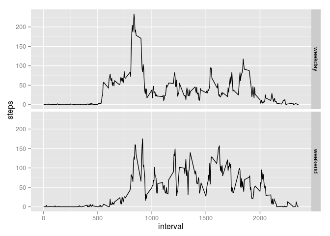

# Reproducible Research: Peer Assessment 1


## Loading and preprocessing the data


```r
# read data
activity_raw <- read.csv(unz("activity.zip", "activity.csv"))

# remove nas
activity <- activity_raw[!is.na(activity_raw$steps),]
```


## What is mean total number of steps taken per day?


```r
# histogram of the total number of steps taken each day
activity_by_day <- aggregate(steps ~ date, data = activity, sum)
hist(activity_by_day$steps, xlab = "# steps", ylab = "# days", main = "Steps per day")
```

 

```r
# mean steps per day
mean(activity_by_day$steps)
```

```
## [1] 10766.19
```

```r
# median steps per day
median(activity_by_day$steps)
```

```
## [1] 10765
```


## What is the average daily activity pattern?


```r
# time series plot of 5-minute interval and average number of steps taken
activity_by_interval <- aggregate(steps ~ interval, data = activity, mean)
plot(activity_by_interval$interval, activity_by_interval$steps, type="l", xlab="5-minute interval", ylab="Average # steps", main="Average steps per 5-minute interval")
```

 

```r
# 5-minute interval with maximum number of steps
activity_by_interval[activity_by_interval$steps == max(activity_by_interval$steps),]
```

```
##     interval    steps
## 104      835 206.1698
```

The daily activity happens throughout the day, with a peak in the morning. At night, there is little to no activity.


## Imputing missing values


```r
# total number of missing values
sum(is.na(activity_raw$steps))
```

```
## [1] 2304
```

```r
# fill in the missing values, using mean of 5-minute interval
activity_na <- activity_raw[is.na(activity_raw$steps),]
activity_na$steps <- activity_by_interval[activity_na$interval == activity_by_interval$interval,]$steps

# create a new dataset with missing data filled in
activity_full <- rbind(activity, activity_na)

# histogram of steps taken each day
activity_by_day_full <- aggregate(steps ~ date, data = activity_full, sum)
hist(activity_by_day_full$steps, xlab = "# steps", ylab = "# days", main = "Steps per day")
```

 

```r
# mean steps per day
mean(activity_by_day_full$steps)
```

```
## [1] 10766.19
```

```r
# median steps per day
median(activity_by_day_full$steps)
```

```
## [1] 10765.59
```

These values differ only slightly from the values in the first part of the assignment. The histogram has more days with steps around the average. This is because all the missing values were within 8 days that only had missing values. The estimated values used for missing values used the average of each 5-minute interval, so these days all had the same number of total steps. The mean is the same because the mean values were used to estimate the missing values. The median differs slightly due to the addition of 8 extra days with values.


## Are there differences in activity patterns between weekdays and weekends?


```r
# create a new factor variable
activity_full$day_type <- lapply(activity_full$date, function(x) { if (weekdays(as.Date(x)) %in% c("Saturday", "Sunday")) {"weekend"} else {"weekday"}})
activity_full$day_type <- as.factor(as.character(activity_full$day_type))

# make panel plot of 5-minute interval
activity_by_interval_full <- aggregate(steps ~ interval + day_type, data = activity_full, mean)
library(ggplot2)
qplot(interval, steps, data = activity_by_interval_full, facets = day_type ~ ., geom="line")
```

 

The activity pattern on the weekend starts a bit later in the day and continues bit later into the evening than the activity pattern on the weekend.
